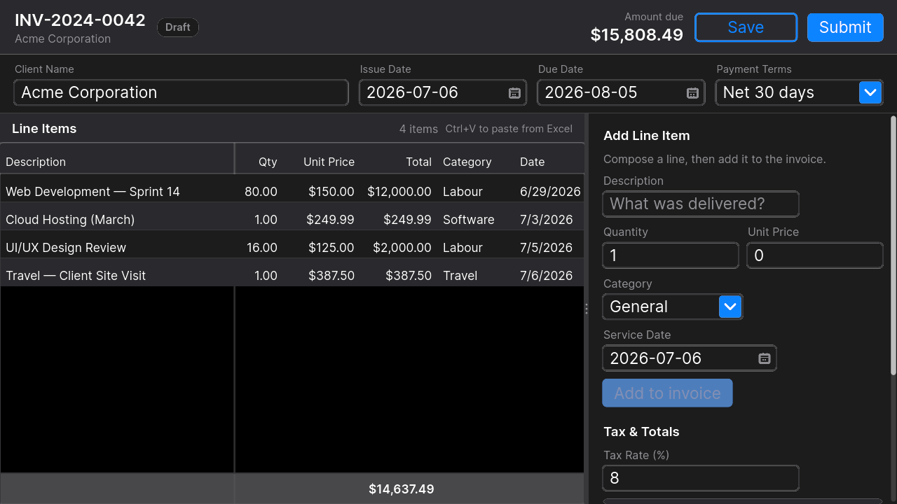

# Invoice Editor — Golden Example 08

A small but complete invoicing screen built on Cascade UI's `DataGrid`. Invoice-level
details (client, dates, payment terms) live in the header. Line items live in an
editable grid on the left; new lines are composed in the **Add Line Item** panel on
the right and appended to the grid. The running total updates live. One row is flagged
**locked** (approved on a previous revision) and cannot be deleted. Submitting files the
invoice and resets the editor for the next one.

It runs on the **Apple Dark** theme and the Etch GPU backend.



## Run it

```powershell
dotnet build examples/InvoiceEditor/InvoiceEditor.csproj
Start-Process examples/InvoiceEditor/bin/Debug/net10.0/InvoiceEditor.exe
```

The app opens on a 600 ms loading state (a `Spinner`) that simulates fetching the
draft, then shows a populated invoice.

## Layout & flow

```
┌─ INV-2024-0042  [Draft]                    Amount due $X  [Save Draft] [Submit] ─┐
├─ Client Name        Issue Date     Due Date       Payment Terms  (invoice header)─┤
├───────────────────────────────────┬─────────────────────────────────────────────┤
│  Line Items (editable DataGrid)    │  Add Line Item                              │
│  Description  Qty  Price  …  Date   │    Description / Qty / Price / Category /    │
│  … rows, edited inline …            │    Service Date  → [Add to invoice]         │
│  Σ subtotal                         │  Tax & Totals  ·  Notes                     │
└───────────────────────────────────┴─────────────────────────────────────────────┘
```

- **Header** — invoice-wide fields: client, issue/due dates, payment terms. A status
  pill (Draft / Saving… / Submitted) and the live **Amount due** sit top-right.
- **Left** — the line-items `DataGrid`. Existing rows are edited **inline**.
- **Right** — the **Add Line Item** composer (append a new row), then **Tax & Totals**
  and **Notes**.

## What it demonstrates

- **`DataGrid<LineItem>`** with editable **Text**, **Number**, **Select**, and **Date**
  columns plus a read-only **Computed** column (`Total = Qty × Unit Price`).
- **Per-column validation** — quantity `> 0`, unit price `≥ 0`.
- **Per-row validation** — a cross-column rule: description required once a price is set.
- **`AggregateRow`** — a live subtotal in the grid footer.
- **A composer form that appends rows**; `DeleteRow` (with a `canDelete` predicate that
  protects the locked row) and `DuplicateRow` manage existing ones.
- **Clipboard support** — paste tab-separated rows straight from Excel (`Ctrl+V`).
- **Reactive computed properties** (`Subtotal`, `TaxAmount`, `Total`) driving both the
  header "Amount due" and the totals box, with no manual wiring.
- **Async submit** with a guard clause, a status pill, and a **reset-for-next** flow.
- **No dependency injection** — state lives on the component; nothing is allocated
  before it is needed.

## How to interact with it

### Header & the Add Line Item panel

Click any field and edit it directly — text fields show a caret and accept typing
immediately; the date fields open a calendar popup; the selects open a dropdown.
Changing the tax rate re-computes the tax and total live.

To add a line: fill the **Add Line Item** form and press **Add to invoice** (enabled
once a description is entered). The row is appended to the grid and the form clears for
the next one.

### Editing the grid

The grid uses a **click-to-select, then click-to-edit** model, like a spreadsheet:

1. **First click** on a row selects it (and focuses the grid for keyboard use).
2. **Second click** on a cell of the selected row begins editing it — Text/Number cells
   show an inline editor (`Enter` commits, `Esc` cancels); Category opens a dropdown;
   Date opens a calendar.

Other gestures: **delete / duplicate** a row (the locked *Web Development* row cannot be
deleted), **paste from Excel** (`Ctrl+V`), **undo / redo** (`Ctrl+Z` / `Ctrl+Y`).

### Submit

**Submit** files the invoice (disabled when there are no line items): the pill flips to
**Submitted**, a banner shows briefly, then the editor **resets** to a fresh draft —
next invoice number, empty client, no line items — ready for the next one. **Save Draft**
just simulates a save without submitting.

## Code tour

Everything lives in [`InvoiceEditorPage.cs`](InvoiceEditorPage.cs):

| Concern | Where |
| --- | --- |
| Data model | `LineItem`, `InvoiceDraft` |
| Simulated async load | `OnMounted` (600 ms `Delay`, then `Invalidate`) |
| Live totals | `Subtotal`, `TaxAmount`, `Total` computed properties |
| Header (title, status pill, amount, actions) | `NavBar`, `StatusPill` |
| Invoice-level fields | `InvoiceHeader` |
| Line-items grid + column/validation config | `InvoiceDataGrid` |
| Add-line composer | `AddLineItemSection`, `AddLineItem` |
| Tax & totals, notes | `TaxSection`, `NotesSection` |
| Submit → reset | `OnSubmit`, `ResetForNewInvoice` |

The **Computed column** is the pattern to notice: `Total` is *not* stored on `LineItem`.
The grid is given a formula (`row.Quantity * row.UnitPrice`) and recomputes it on every
cell change — including inside the `AggregateRow`. Nothing to keep in sync by hand.

## DataGrid rule of thumb

- **`DataTable`** — display and sort. No editing.
- **`DataGrid`** — editing, adding, deleting, pasting. Use it when the user needs to
  *manipulate* the data, not just read it.

## Framework notes

Fixes made while getting this example into shape — all in the framework, so they benefit
every app:

- **Live edits inside a `ScrollView` now render.** A ScrollView caches its content in a
  retained GPU layer; an in-place edit didn't mark it dirty, so typed text never showed.
  The painter now recaptures while the content holds a focused editable control (and once
  when focus leaves). See `NodePainter.PaintScrollView` / `SubtreeContainsFocusedEditable`.
- **Popups over a cached ScrollView are no longer occluded.** A layer texture is composited
  as an image that the image pass draws over deferred popup shapes; ScrollViews now fall
  back to direct paint while any popup is open (`frameHasOpenPopup`).
- **Grid Date/Select commits refresh the cell.** `CommitDateValue` / `CommitSelectOption`
  now invalidate the cell-text cache, so the new value shows immediately.
- **Carets blink in every text control.** `IsCaretActive` now covers `TextArea`, password,
  pin, tag inputs, and grid-cell edits, so the frame loop keeps ticking for a smooth blink.
- **`TextArea` no longer tints its surface on focus** (it matched `TextInput`'s border-only
  focus treatment).
- **Empty grids show a default "No items"** message instead of a blank body.
